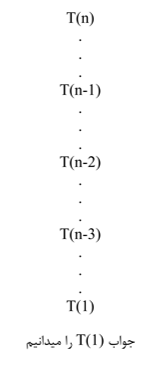
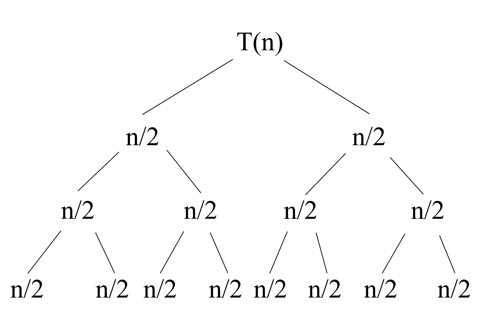

# محاسبه پیجیدگی زمانی الگوریتم Merge Sort با C#

## Merge Sort
#### الگوریتم Merge Sort یکی از انواع الگوریتم مرتب سازیه که از راهکار تقسسیم و غلبه استفاده میکنه؛  یعنی مسئله بزرگ رو به زیرمسائل کوچکتر تقسیم می کنه تا بتونه حلش کنه


#### برای جلوگیری از توضیحات اضافه اینجا میتونید مراحل انجام Merge Sort رو step by step  یاد بگیرین😉
<https://www.w3schools.com/dsa/dsa_algo_mergesort.php>


##  Source code
#### سودوکد برای نوشتن کد اصلی

```
Mergesort(A[], low,high)
{
    if (low<high)
    {
        mid = (low + high)/2;
        Mergesort(A,low,mid);
        Mergesort(A,mid+1,high);
        Merge(A,low,mid,high);
    }
}

Mergesort(A[], low,high)
{
    if (low<high)
    {
        mid = (low + high)/2;
        Mergesort(A,low,mid); Mergesort(A,mid+1,high);
        Merge(A,low,mid,high);
    }
}
    Merge(A[],low, mid, high)
    {
        i = low; j = mid + 1; k = low;
        while (i < mid and j < high)
        {
            if (A[i] < A[j])
            {B[k] = A[i] ; i++;}
            else {
                B[k] = A[j]; j++;
            k++
                 }
            while(i≤mid)
            {B[k] = A[i]; i++; k++;}
            while(j≤high)
            {B[k] = A[j]; j++; k++;}
        }
    }
    
```
## Time Complexity in Merge Sort


#### همونطوری که تو کدها مشخصه کد شامل یک تابع Mergesort به همراه یک شرط ، یک محاسبه خطی ، دو فراخوانی مجدد Mergesort که تابع رو از نوع بازگشتی می کنه و یک فراخوانی تابع Merge میشه، یک حلقه While هم داشتیم با پیجیدگی زمانی n . برای محاسبه پیچیدگی زمانی اول باید تابع ریاضی این الگوریتم رو بنویسیم و چون این الگوریتم  تابع بازگشتی داره سراغ فراخوانی بازگشتیش میریم؛ توابع بازگشتی تا وقتی ادامه پیدا می کنن که اندازه آرایه شون 2 یا 1 بشه یا در واقع تا جایی که ما جواب رو می دونیم. مثلا تابع فاکتوریل که بصورت بازگشتی حل میشه درختش به شکل زیر درمیاد:



#### تابع ریاضی فاکتوریل n است ( کافیه تعدادگره های یک درخت رو بشمری تا به تابع ریاضیش برسیم! ).
 حالا برمی گردیم به Mergesort خودمون





#### تا اینجا 2*T(  n/2  ) داریم، بعدازاینکه به برگ ها رسیدیم. تابع Merge از پایین به بالا شروع به صدا زده شدن می کنه .داخل تابع Merge یدونه حلقه ی while داشتیم؛ پیچیدگی زمانی حلقه ی while   میشه n .
#### پس:

#### 2*T(  n/2  ) + n
 #### حالا می خوایم O  را حساب کنیم که این کار رو با استفاده از قضیه Mster انجام میدیم؛ قضیه Master برای درآوردن راحت تر O در مسائل بازگشتیه (اینجا به اثباتش نمی پردازیم!)
#### قضیه Master سه تا حالت داره
####  1 .  a > b^k   =   θ ( n^loga )
####  2 .  a = b^k   =   θ ( n^k logn )
####  3 .  a < b^k   =   θ ( n^k )
#### که در توابع ریاضی با این قیافع بررسی میشن🙂 
#### T(n) = aT( n/b ) + nk
#### تابع ریاضی که ما بدست آوردیم این بود :
#### T(n) = 2T (  n/2 ) + n
#### در نتیجه
#### a = 2
#### b = 2
#### k = 1
#### پس a = b^k  و شرط دوم برقراره  ، پس :
#### θ = ( n^k logn )    →       n^1 logn        →      nlogn
#### پس پیچیدگی زمانی برابر میشه با n(logn)، که یه پیچیدگی زمانی بسیار کم و معقولیه 🙂
